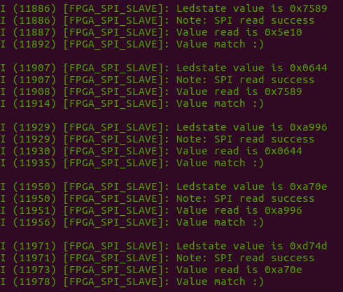

ESP32-master FPGA-slave SPI communication
=========================================

Purpose of this project is to test spi communication between an ESP32 and Basys3 FPGA board with the Artix-7 35T FPGA.

The vivado project folder is named "FPGA"

## Purpose 

Test the SPI full duplex mode 0 communication between ESP32 master and FPGA slave. This is meant to be useful when the ESP32 is the master and FPGA is a slave controlling other high speed asynchronous activities and there may be a need to read and write at the same time. The intended functionality is meant to mimic the [SX1301](https://www.google.com/url?sa=t&rct=j&q=&esrc=s&source=web&cd=1&cad=rja&uact=8&ved=2ahUKEwiJ347M5qjeAhUGKBoKHYEaAYcQFjAAegQIARAC&url=https%3A%2F%2Fwww.semtech.com%2Fuploads%2Fdocuments%2Fsx1301.pdf&usg=AOvVaw2KKa1S9cJEAFlk_XqdEVMx) from Semtech and is meant to be used in testing integrating the ESP32 to FPGA controlled, low datarate, IoT RF protocols, such as the LPWAN such as WeightlessTM among others.

## Operation

Read current state of LEDs on the Basys3 board and set the state of the LEDs. The FPGA initially sets all LEDs to the off state.

The spi transactions shall be full duplex with a transaction size of 2 bytes to set the state of all 16 LEDs. The ESP32 shall check the read current LEDs state and send the next state randomly by a PRNG with a fixed seed after a periodic interval.

If the read state matches the state written previously, it reports back an okay status to the user via UART to the computer. If not, it reports a failure status.

The status of the communication is inspected via a logic analyzer for the first few transactions. Images and actual capture files are stored in the logic_analyzer_cap folder.

This example shall only work with SPI mode 0.

